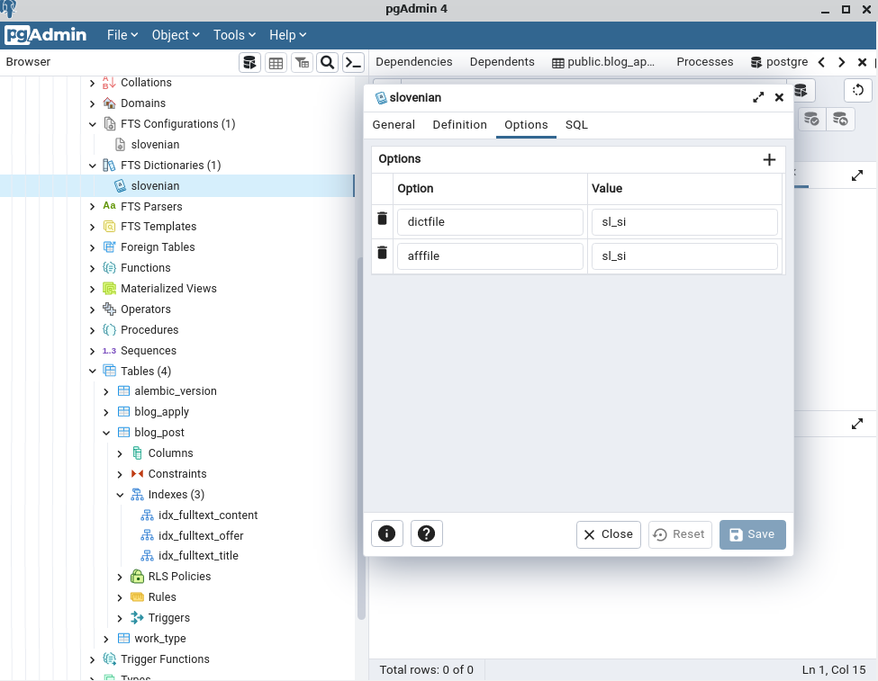
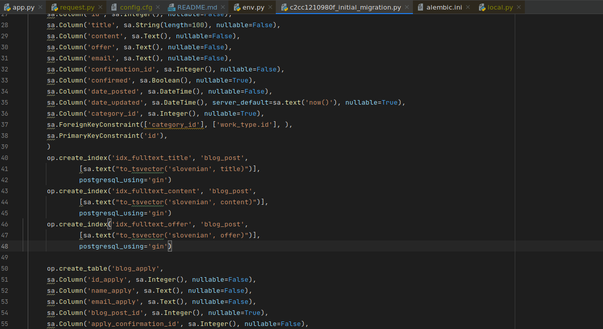
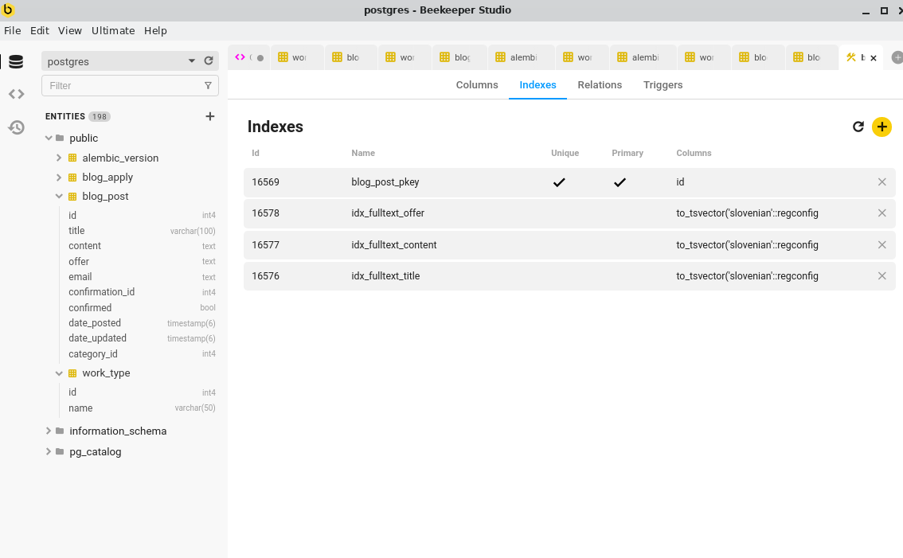

# App

## Development

### Postgresql setup

Install postgresql database

```shell
sudo apt install postgresql
sudo systemctl start postgresql

# set postgresql password
sudo su
sudo -u postgres psql
>>  ALTER USER postgres PASSWORD 'postgres';
```

Check if database is working

```shell
sudo systemctl status postgesql
```

Connecting to database:

- Use a client like https://www.beekeeperstudio.io/
- Connect using terminal:

```shell
psql -U postgres -h 127.0.0.1 postgres
postgres=# select * from blog_post;
```

Creating slovenian full text search dictionary and configuration that is used for full
text search indexes:

```sql
CREATE TEXT SEARCH DICTIONARY public.slovenian (
  TEMPLATE = ispell,
  DictFile = sl_si,
  AffFile = sl_si
);

CREATE TEXT SEARCH CONFIGURATION public.slovenian
(COPY = pg_catalog.english);

ALTER TEXT SEARCH CONFIGURATION slovenian
ALTER MAPPING FOR asciiword, asciihword,
hword_asciipart, word, hword, hword_part
WITH slovenian;
```


To check if fulltext search works you can explain a query and see if one of full text
search indexes is used:

```sql
explain select * from blog_post where to_tsvector('slovenian', content) @@ 'stanovanje'
```

### Application setup

Database migration

```shell
rm -r migrations/versions/*
flask db migrate -m "Initial migration."
flask db upgrade
```

Insert this into initial migrations to create full text search indexes:

```python
    op.create_index('idx_fulltext_title', 'blog_post',
            [sa.text("to_tsvector('slovenian', title)")],
            postgresql_using='gin')
    op.create_index('idx_fulltext_content', 'blog_post',
            [sa.text("to_tsvector('slovenian', content)")],
            postgresql_using='gin')
    op.create_index('idx_fulltext_offer', 'blog_post',
            [sa.text("to_tsvector('slovenian', offer)")],
            postgresql_using='gin')

# only above bottom line
    op.create_table('blog_apply',
```



